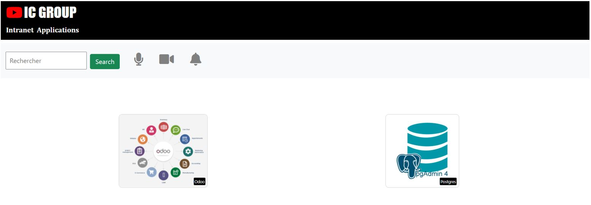
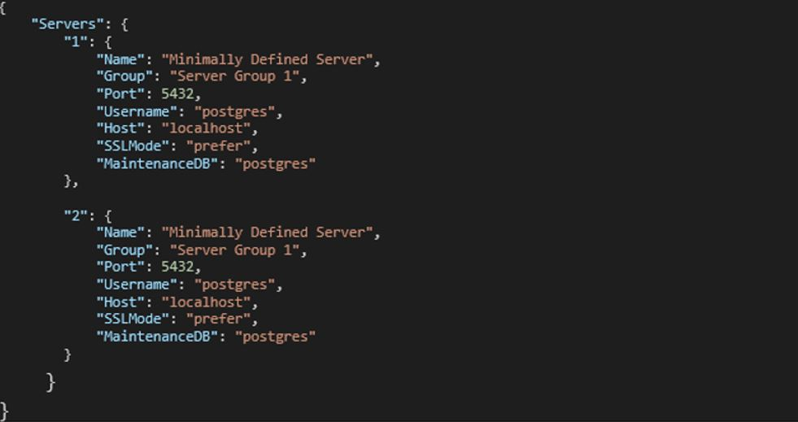

# PROJET FINAL DEVOPS. 

## **1) Introduction**

La société **IC GROUP** dans laquelle vous travaillez en tant qu’ingénieur Devops souhaite mettre sur pied un site web vitrine devant permettre d’accéder à ses 02 applications phares qui sont :  

1) Odoo 
1) pgAdmin 
#### odoo
C'est un ERP multi usage qui permet de gérer le système d'information de l'entreprise, nottament les ventes, les achats, la comptabilité, l’inventaire, le personnel, etc …  

Odoo est distribué en version communautaire et Enterprise. ICGROUP souhaite avoir la main sur le code et apporter ses propres modifications et customisations. Ainsi, l'entreprise a opté pour l’édition communautaire.  Plusieurs versions de Odoo sont disponibles et celle retenue est la version ``13.0``, car elle intègre un système de LMS (Learning Management System) qui sera utilisé pour publier les formations en internes et ainsi diffuser plus facilement l’information.  

#### pgadmin
**pgAdmin** devra être utilisée pour administrer de façon graphique la base de données PostgreSQL, qui est un composant essentiel au fonctionnement de odoo. 

##### Liens utiles : 
- Site officiel de odoo:[ https://www.odoo.com/ ](https://www.odoo.com/) 
- GitHub officiel de odoo:[ https://github.com/odoo/odoo.git ](https://github.com/odoo/odoo.git) 
- Docker Hub officiel de odoo:[ https://hub.docker.com/_/odoo ](https://hub.docker.com/_/odoo) 
- Site officiel de pgadmin:[ https://www.pgadmin.org/ ](https://www.pgadmin.org/) 
- Docker Hub officiel de pgadmin:[ https://hub.docker.com/r/dpage/pgadmin4/ ](https://hub.docker.com/r/dpage/pgadmin4/) 

Le site web vitrine a été conçu par l’équipe de développeurs de l’entreprise et les fichiers y relatifs se trouvent dans le repo suivant: [ https://github.com/sadofrazer/ic-webapp.git ](https://github.com/sadofrazer/ic-webapp.git). Il est de votre responsabilité de conteneuriser cette application tout en permettant la saisie des différentes URL des applications (Odoo et pgadmin) par le biais des variables d’environnement. 

Ci-dessous un aperçu du site vitrine attendu. 

**NB :** L’image** créée devra permettre de lancer un conteneur permettant d’héberger ce site web et ayant les liens adéquats permettant d’accéder à nos applications internes 

## **2) Conteneurisation de l’application web.** 

Il s’agit en effet d’une application web python utilisant le module Flask. Les étapes à suivre pour la conteneurisation de cette application sont les suivantes : 

1) Image de base : `python:3.6-alpine`
2) Définir le répertoire `/opt` comme répertoire de travail 
3) Installer le module Flask version 1.1.2 à l’aide de `pip install flask==1.1.2`
4) Exposer le port `8080` qui est celui utilisé par défaut par l'application
5) Créer les variables d’environnement `ODOO_URL` et `PGADMIN_URL` afin de permettre la définition de ces url lors du lancement du container 
6) Lancer l’application `app.py` dans le `ENTRYPOINT` grâce à la commande `python`  

Une fois le Dockerfile crée, Buildez le et lancer un container test permettant d’aller sur les sites web officiels de chacune de ces applications (site web officiels fournis ci-dessus). 

**Nom de l’image :**  ic-webapp ;*  
**tag :** 1.0*  
**container test_name :** test-ic-webapp* 

Une fois le test terminé, supprimez ce container test et poussez votre image sur votre registre Docker hub. 

## **3) Partie 1 : Déploiement des différentes applications dans un cluster Kubernetes.** 

### **a. Architecture** 

Les applications ou services seront déployées dans un cluster Minikube, donc à un seul nœud et devront respecter l’architecture suivante. 

En vous basant sur cette architecture logicielle, bien vouloir identifier en donnant le type et le rôle de chacune des ressources (A…H)  mentionnées dans cette architecture. 

### **b. Déploiement de l’application Odoo** 

Comme décrite ci-dessus, Odoo est une application web de type 2 tier contenant différents modules facilitant la gestion administrative d’une société. 

En Vous servant des différents liens mentionnés ci-dessus, déployer Odoo à l’aide des images docker correspondantes et assurez vous que les données de la base de données Odoo soit persistantes et sauvegardées dans un répertoire de votre choix sur votre hôte. **NB**: respectez l’architecture ci-dessus 

### **c. Déploiement PgAdmin** 

Comme ci-dessus, servez-vous de la documentation de déploiement de PgAdmin sous forme de container afin de déployer votre application. 

Vous devez par la suite découvrir dans la documentation, le répertoire contenant les données et paramètres de l’application PgAdmin afin de le rendre persistant. 

Notez également que PgAdmin est une application web d’administration des bases de données PostgreSQL, Toutefois, le déploiement d’un container PgAdmin ne nécessite pas obligatoirement la fourniture des paramètres de connexion à une BDD, donc vous pouvez initialement déployer l’interface web en fournissant le minimum de paramètres requis (adresse mail + mot de passe) et ce n’est que par la suite par le biais de l’interface graphique que vous initierez les différentes connexion à vos bases de données. 

Afin de réduire le nombre de taches manuelles, nous souhaiterons qu’au démarrage de votre container PgAdmin, que ce dernier ait automatiquement les données nécessaires lui permettant de se connecter à votre BDD Odoo. Pour ce faire, il existe un fichier de configuration PgAdmin que vous devrez au préalable customiser et fournir par la suite à votre container sous forme de volume. 

Ce fichier doit être situé au niveau du container dans le répertoire : /pgadmin4/servers.json 

### **d. Déploiement des différentes applications** 

En vous servant des données ci-dessus, créez les différents manifests correspondants aux ressources nécessaires au bon fonctionnement de l’application tout en respectant l’architecture fournie (Nbre de réplicas et persistance de données). 

Notez également que l’ensemble de ces ressources devront être crées dans un namespace particulier appelé «i*cgroup*» et devront obligatoirement avoir toutes au moins le label « *env = prod* » 

**NB** : Etant donné que vos manifests pourront être publics (pousser vers un repo Git ), bien vouloir prendre les mesures nécessaires afin d’utiliser les ressources adéquates permettant de cacher vos informations sensibles. 

 ### **e. Test de fonctionnement et rapport final** 

Lancez l’exécution de vos différents manifests afin de déployer les différents services ou applications demandés, testez le bon fonctionnement de vos différentes application et n’hésitez pas à prendre des captures d’écran le plus possible afin de consolider votre travail dans un rapport final qui présentera dans les moindre détails ce que vous avez fait. 

## **3) Partie 2 : Mise en place d'un pipeline CI/CD à l'aide de JENKINS et de ANSIBLE.** 
L'objectif de ICGROUP est en effet de mettre sur pied un pipeline CI/CD permettant l'intégration et le déploiement en continu de cette solution sur leurs différentes machines en environnement de production (03 serveurs hébergés soit en On Premises soit dans le cloud AWS)

### **a. Pipeline Stages** 

### **b. Infrastructure** 

Pour ce projet, on aura besoin de 03 serveurs hébergées soit dans le cloud ou en On Premises (VirtualBox, VMWare…) pour ceux qui n’ont pas de comptes cloud (AWS, AZURE ou autres).
Les serveurs nécessaires sont les suivants : docker_jenkins: [ https://github.com/sadofrazer/jenkins-frazer.git ](https://github.com/sadofrazer/jenkins-frazer.git)

        1) **Serveur 1** : Jenkins (AWS, t2.medium, docker_jenkins: https://github.com/sadofrazer/jenkins-frazer.git)
        2) **Serveur 2** : Applications web site vitrine + pgadmin4 (AWS, t2.micro)
        3) **Serveur 3** : Application Odoo (AWS, t2.micro)

### **c. Automatisation du déploiement**

Afin de faciliter le déploiement de nos application dans notre pipeline Jenkins, nous allons créer des rôles ansible à l’aide de l’IAC docker (Docker-compose) et Ansible.
Les étapes sont les suivantes :

    1) Créer un docker-compose permettant de déployer entièrement l’application Odoo tout en créant un réseau docker et un volume pour faire persister les données de la BDD
    2) Créer un docker-compose permettant de déployer l’application pgadmin avec les paramètres décrits dans la partie1 (fichier servers.json et persistance des données).
    3) A l’aide de ces docker-compose comme Template, créer deux rôles ansible que vous appellerez odoo_role et pgadmin_role, dans ces rôles vous devez :
        a) Variabiliser le nom du réseau et du volume qui sera créé dans docker
        b) Variabiliser le répertoire de montage pour le volume, permettant à l’utilisateur de définir s’il le souhaite un autre chemin de fichier en local sur son serveur où il souhaite stocker les données de la BDD Odoo 
        c) Variabiliser le nom des services et des containers qui seront créés par ce docker-compose.

**NB** : Ces rôles devront être appelés dans votre pipeline lors de la phase de déploiement avec les variabilisations qui vont bien.

### **d. Mise en place du pipeline**

Afin de davantage automatiser notre solution, vous devez créer à la racine de votre repo, un fichier appelé releases.txt dans lequel vous enterrez les données sur votre application ( ODOO_URL, PGADMIN_URL et Version)
Ce fichier devra contenir 03 lignes et 02 colonnes ( séparateur de colonne étant l’espace)
Exemple 

Par la suite, vous devez modifier votre Dockerfile afin qu’il puisse lors du build récupérer les valeurs des URL du fichier releases.txt et les fournir automatiquement aux variables d’environnement crées dans le Dockerfile.
Cela devra se faire grâce aux commandes awk et export. Ci-dessous un exemple.

Après avoir crée le Dockerfile qui va bien, Vous devrez créer le JenkinsFile permettant de Builder l’application, la tester (à vous de trouver les différents tests à réaliser sur chacune des applications) et la déployer en environnement de production.
**NB** : vous devrez utiliser les mêmes mécanismes afin de récupérer la valeur de la variable version dans le fichier releases.txt qui devra être utilisé comme tag sur votre image.

### **e. Test de fonctionnement et rapport final**

Lancez l’exécution de votre pipeline manuellement pour une première fois, ensuite automatiquement après modification de votre fichier releases.txt (version : 1.1). Vérifiez que toutes les applis sont déployées et fonctionnent correctement. N’hésitez pas à prendre des captures d’écran le plus possible afin de consolider votre travail dans un rapport final qui présentera dans les moindre détails ce que vous avez fait.

 ## **4) ANNEXE** 

Ci-dessous un exemple de description des qualifications souhaitées pour un poste de Devops 

**NB** : Bien vouloir preter attention aux qualités encadrées en jaune ci-dessus, vous vous rendez compte en effet que maitriser les technologies seulement ne suffit pas, il faut en plus de ca avoir un esprit très créatif, de très bonnes capacités redactionnelles pour rediger vos différents rapports et également des qualités de pédagogue qui vous aideront à parfaire les explications de vos actions dans vos différents rapports afin de faciliter leur compréhension. 

Compte tenu de tout cela, je vous invite tous à donner l’impotance à ce volet « rapport » de votre projet final, car c’est également une partie très importante qui devra pouvoir décrire le contenu de l’ensemble de votre travail.  

Merci de le rédiger correctement avec les captures d’écran, commentaires et explications qui vont bien car cette partie sera prise en compte dans votre note finale.
